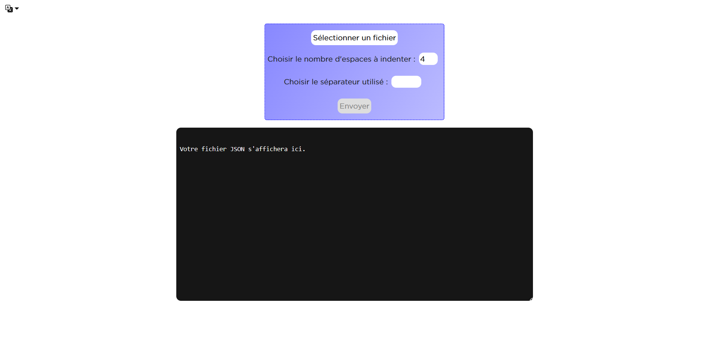
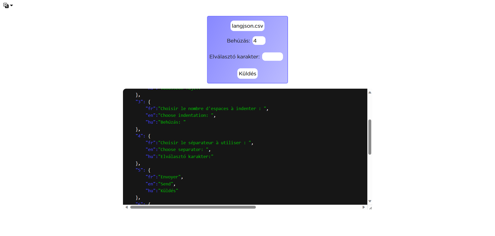

# Description
> Cette application web permet de convertir un fichier de données traduites brutes au format JSON afin de pouvoir implémenter facilement des versions d'un site traduites dans d'autres langues.
# Installation
Il suffit de cloner ce répertoire vers le dossier public d'un serveur local (par exemple `C:/xampp/htdocs` pour [**```Xampp```**](https://www.apachefriends.org/download.html)), le démarrer, puis se rendre à l'adresse correspondante (http://localhost/langjson).
# Mode d'emploi
Le fichier `.csv` ou `.txt` en entrée doit avoir la structure suivante :

| **id** | id_langue1 | id_langue2 |   …   |
| :----: | :--------: | :--------: | :---: |
|   1    |  Texte 1   |  Texte 2   |   …   |
|   2    |  Texte 3   |  Texte 4   |   …   |
|   …    |     …      |     …      |   …   |
|   18   |  Texte 35  |  Texte 36  |   …   |
|   …    |     …      |     …      |   …   |

La liste des codes **ISO 639-1** pour les langues est disponible [ici](https://fr.wikipedia.org/wiki/Liste_des_codes_ISO_639-1). Les séparateurs de données autorisés sont les suivants :

* , (Virgule)
* ; (Point-virgule)
*   (Espace)
* \t (Tabulation)

Le séparateur est généralement automatiquement détecté lors du tévéversement du fichier. Dans le cas contraire, il est possible de choisir manuellement le séparateur, mais l'application risque de dysfonctionner.

Il suffit ensuite de téléverser le fichier sur le site ou de le faire glisser directement afin de pouvoir en voir un aperçu et le convertir.
Le fichier JSON ainsi obtenu peut-être utiliser pour charger les données dans différentes langues. Ce site lui-même a été traduit à l'aide de son propre outil.

Le fichier source CSV utilisé pour la traduction du site et le fichier JSON converti sont disponibles à la racine du projet à titre d'exemple.

# Captures d'écran

## Vue générale

## Téléversement du fichier de données

## Fichier JSON converti 
